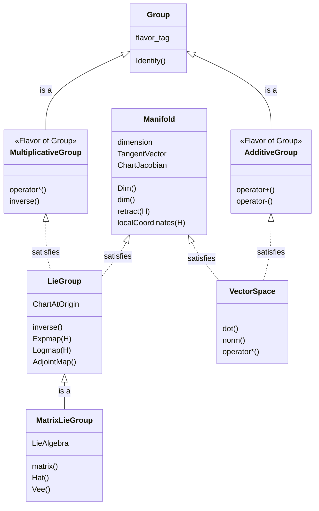

# GTSAM Concepts

GTSAM is built upon a foundation of generic programming, using C++ concepts to define the requirements for types used in optimization and modeling. A "concept" is a set of requirements that a type must fulfill to be used with GTSAM's generic algorithms. These requirements can include associated types, specific methods, and mathematical invariants.

This document provides a high-level overview of the most important concepts in GTSAM. For detailed instructions on how to implement a custom class that satisfies these concepts, please refer to the specific guides in the `gtsam/base/doc/` directory.

GTSAM uses two primary mechanisms to connect user-defined types to its framework:
1.  **Traits-based Metaprogramming**: Instead of traditional inheritance, you specialize a `gtsam::traits` struct for your class. This specialization informs GTSAM about the capabilities and properties of your type.
2.  **Concept Checking Macros**: GTSAM provides compile-time macros (e.g., `GTSAM_CONCEPT_MANIFOLD_INST`) that verify your class correctly implements all requirements of a concept.

---

## Testable

Nearly every concept in GTSAM requires the `Testable` concept as a prerequisite. This provides a common interface for unit testing. To be `Testable`, a class must provide two methods:
*   `print(const std::string& s)`: For displaying the object's value.
*   `equals(const T& other, double tol)`: for comparing two objects for equality within a tolerance.

The detailed guides for each concept explain this requirement further.

## Manifold

A [differentiable manifold](https://en.wikipedia.org/wiki/Differentiable_manifold) is a non-linear space that can be locally approximated at any point by a vector space, known as the tangent space. This is the most fundamental concept for non-linear optimization in GTSAM.

The core operations for a manifold are:
*   `retract`: Generalizes vector addition. It maps a vector from the tangent space at a point back onto the manifold.
*   `localCoordinates`: Generalizes vector subtraction. It computes the tangent vector that connects two points on the manifold.

These operations must be inverses of each other: `p.retract(p.localCoordinates(q))` should be equal to `q`.

For a detailed guide on creating a new `Manifold` type, see {doc}`../gtsam/base/doc/Manifold.md`.

## Group

A [group](https://en.wikipedia.org/wiki/Group_(mathematics)) is an algebraic structure with a composition operation that is associative, has an identity element, and for which every element has an inverse.

Key operations are `compose`, `inverse`, and `between`. GTSAM distinguishes between two "flavors" of groups based on their composition operator:
*   **Multiplicative Groups**: Use `operator*` (e.g., rotations, poses).
*   **Additive Groups**: Use `operator+` (e.g., vectors).

For a detailed guide on creating a `Group` type, see {doc}`../gtsam/base/doc/Group.md`.

## Lie Group

A [Lie group](https://en.wikipedia.org/wiki/Lie_group) is a space that is both a `Group` and a `Manifold`, with the added requirement that the group operations are smooth. This is the central concept for representing poses and rotations in robotics and computer vision.

Lie groups have a special identity element, which allows for defining global `Expmap` and `Logmap` operations that map between the manifold and its tangent space at the identity. In GTSAM, implementing a `LieGroup` is often simplified by inheriting from a Curiously Recurring Template Pattern (CRTP) base class, which provides many methods for free.

Most Lie groups in GTSAM are also **Matrix Lie Groups**, which have an underlying matrix representation. These require additional Lie algebra operations like `Hat` and `Vee`.

*   For a guide on creating a `LieGroup`, see {doc}`../gtsam/base/doc/LieGroup.md`.
*   For matrix Lie groups, also see {doc}`../gtsam/base/doc/MatrixLieGroup.md`.

## Vector Space

A `VectorSpace` is a specialized `AdditiveGroup` that also supports scalar multiplication, a dot product, and the calculation of a norm. This concept should be satisfied by types that behave like mathematical vectors. In GTSAM, vector spaces are the foundation for tangent spaces on manifolds.

For a detailed guide, see {doc}`../gtsam/base/doc/VectorSpace.md`.

## Overview

The Mermaid diagram below summarizes the relationships between the different geometry concepts:

---

## Future Concepts

The concepts below describe more advanced usage patterns, such as the action of a group on a manifold.

### Group Action

Group actions are concepts in and of themselves. In particular, a group can *act* on another space. We formalize this by the following extension of the concept:

*   valid expressions:
    *   `q = traits<T>::Act(g,p)`, for some instance, *p*,  of a space *S*, that can be acted upon by the group element *g* to produce *q* in *S*.
    *   `q = traits<T>::Act(g,p,Hp)`, if the space acted upon is a continuous differentiable manifold.

### Lie Group Action

When a Lie group acts on a space, we have two derivatives to care about:

  *   `gtsam::manifold::traits<T>::act(g,p,Hg,Hp)`, if the space acted upon is a continuous differentiable manifold.

An example is a *similarity transform* in 3D, which can act on 3D space. The derivative in `p`, `Hp`, depends on the group element `g`. The derivative in `g`, `Hg`, is in general more complex.