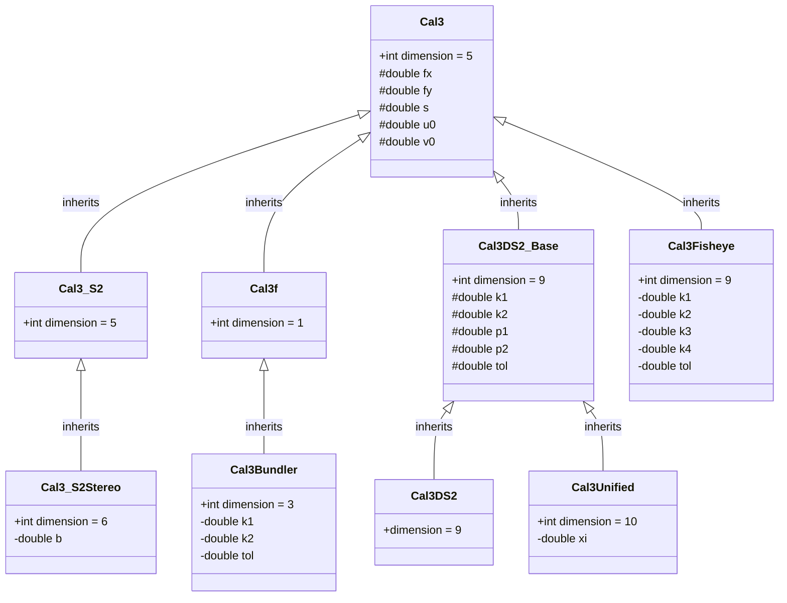

# Geometry

The `geometry` module provides the core classes for geometric concepts in GTSAM. This includes fundamental types such as Lie groups for rotations and poses, classes for 2D and 3D points, and various camera models for calibration. These representations are essential building blocks for many algorithms in the library, especially for inference and SLAM applications.

## Core Types

- [Rot2](doc/Rot2.ipynb) and [Rot3](doc/Rot3.ipynb): Represent 2D and 3D rotation groups.
- [Pose2](doc/Pose2.ipynb) and [Pose3](doc/Pose3.ipynb): Rigid body poses in 2D and 3D.
- [Point2](https://github.com/borglab/gtsam/blob/develop/gtsam/geometry/Point2.h) and [Point3](https://github.com/borglab/gtsam/blob/develop/gtsam/geometry/Point3.h): Basic 2D and 3D point containers.
- [Unit3](https://github.com/borglab/gtsam/blob/develop/gtsam/geometry/Unit3.h): Direction vectors with unit length.
- [Similarity2](https://github.com/borglab/gtsam/blob/develop/gtsam/geometry/Similarity2.h) and [Similarity3](https://github.com/borglab/gtsam/blob/develop/gtsam/geometry/Similarity3.h): Similarity transformations combining rotation, translation, and scale.
- [SO3](doc/SO3.ipynb), [SO4](https://github.com/borglab/gtsam/blob/develop/gtsam/geometry/SO4.h), and [SOn](https://github.com/borglab/gtsam/blob/develop/gtsam/geometry/SOn.h): General special orthogonal group implementations.
- [Quaternion](https://github.com/borglab/gtsam/blob/develop/gtsam/geometry/Quaternion.h): Quaternion wrapper for rotations.

## Calibration Models
This section describes the classes representing different camera calibration models in GTSAM. These models handle the conversion between a camera's 3D coordinate system and the 2D image plane, accounting for intrinsic parameters like focal length, principal point, and lens distortion.

The models are organized in a class hierarchy, with more specialized models inheriting from base classes.

### Cal3
[Cal3](https://github.com/borglab/gtsam/blob/develop/gtsam/geometry/Cal3.h) is the common base class for all calibration models. It stores the five standard intrinsic parameters:
- `fx`, `fy`: Focal length in x and y.
- `s`: Skew factor.
- `u0`, `v0`: Principal point (image center).

It provides the basic functionality but is not intended to be used directly in optimization, as it does not define a manifold structure itself.

### Cal3_S2
[Cal3_S2](doc/Cal3_S2.ipynb) is the most common 5-degree-of-freedom (DOF) calibration model and is designed for use in optimization. It represents the five parameters of Cal3 on a 5-dimensional manifold, allowing it to be used directly in factor graphs.

### Cal3_S2Stereo

[Cal3_S2Stereo](https://github.com/borglab/gtsam/blob/develop/gtsam/geometry/Cal3_S2Stereo.h) extends `Cal3_S2` for use with stereo cameras. It inherits the five standard intrinsic parameters and adds a sixth parameter, `b`, for the stereo baseline. This results in a 6-dimensional manifold for optimization.

### Cal3f

[Cal3f](https://github.com/borglab/gtsam/blob/develop/gtsam/geometry/Cal3f.h) is a special, simplified model that assumes zero skew and a single focal length $f$ (i.e., $f_x = f_y$). The principal point $(u_0, v_0)$ is also considered a fixed constant and is not optimized.

Because only the focal length $f$ is a variable, `Cal3f` has a manifold dimension of 1. This makes it extremely efficient for scenarios where you only need to calibrate for focal length, as the optimization space is much smaller.

### Cal3Bundler

[Cal3Bundler](https://github.com/borglab/gtsam/blob/develop/gtsam/geometry/Cal3Bundler.h) is designed to be compatible with Bundler, a structure-from-motion (SfM) system for unordered image collections written in C and C++. It inherits from `Cal3f` and adds two radial distortion coefficients, `k1` and `k2`. This gives it a total of 3 degrees of freedom for optimization.

### Cal3Fisheye

[Cal3Fisheye](https://github.com/borglab/gtsam/blob/develop/gtsam/geometry/Cal3Fisheye.h) is designed for cameras with fisheye lenses and implements the distortion model used by OpenCV. It inherits from the base `Cal3` class and adds four fisheye-specific distortion coefficients: `k1`, `k2`, `k3`, and `k4`. This results in a 9-dimensional manifold for optimization.

### Cal3DS2_Base, Cal3DS2, and Cal3Unified

This group of classes handles standard radial and tangential lens distortion, as specified by OpenCV.

- [Cal3DS2_Base](https://github.com/borglab/gtsam/blob/develop/gtsam/geometry/Cal3DS2_Base.h): This is a base class that adds four distortion parameters (`k1`, `k2` for radial and `p1`, `p2` for tangential) to the five standard parameters from `Cal3`, for a total of 9 parameters.
- [Cal3DS2](https://github.com/borglab/gtsam/blob/develop/gtsam/geometry/Cal3DS2.h): This class inherits from `Cal3DS2_Base` and implements the necessary manifold structure, making the 9-DOF model usable for optimization.
- [Cal3Unified](https://github.com/borglab/gtsam/blob/develop/gtsam/geometry/Cal3Unified.h): This model is for omni-directional cameras and extends `Cal3DS2_Base` by adding a mirror parameter `xi`. This brings the total number of parameters to 10, creating a 10-dimensional manifold for optimization.

## Camera Models

This section describes the classes representing different camera models.

- Intrinsic calibration types such as [Cal3_S2](doc/Cal3_S2.ipynb), [Cal3Bundler](https://github.com/borglab/gtsam/blob/develop/gtsam/geometry/Cal3Bundler.h), [Cal3_S2Stereo](https://github.com/borglab/gtsam/blob/develop/gtsam/geometry/Cal3_S2Stereo.h), [Cal3Fisheye](https://github.com/borglab/gtsam/blob/develop/gtsam/geometry/Cal3Fisheye.h), and [Cal3Unified](https://github.com/borglab/gtsam/blob/develop/gtsam/geometry/Cal3Unified.h).
- Camera wrappers including [PinholeCamera](https://github.com/borglab/gtsam/blob/develop/gtsam/geometry/PinholeCamera.h), [PinholePose](doc/PinholePose.ipynb), [CalibratedCamera](https://github.com/borglab/gtsam/blob/develop/gtsam/geometry/CalibratedCamera.h), [SimpleCamera](https://github.com/borglab/gtsam/blob/develop/gtsam/geometry/SimpleCamera.h), [StereoCamera](https://github.com/borglab/gtsam/blob/develop/gtsam/geometry/StereoCamera.h), and [SphericalCamera](https://github.com/borglab/gtsam/blob/develop/gtsam/geometry/SphericalCamera.h).
- Associated measurement types such as [StereoPoint2](https://github.com/borglab/gtsam/blob/develop/gtsam/geometry/StereoPoint2.h) and utilities for working with sets of cameras ([PinholeSet](https://github.com/borglab/gtsam/blob/develop/gtsam/geometry/PinholeSet.h), [CameraSet](https://github.com/borglab/gtsam/blob/develop/gtsam/geometry/CameraSet.h)).

## Geometric Relations and Utilities

- [BearingRange](https://github.com/borglab/gtsam/blob/develop/gtsam/geometry/BearingRange.h): Relates bearing and range measurements.
- [EssentialMatrix](https://github.com/borglab/gtsam/blob/develop/gtsam/geometry/EssentialMatrix.h) and [FundamentalMatrix](https://github.com/borglab/gtsam/blob/develop/gtsam/geometry/FundamentalMatrix.h): Two-view geometric relations.
- [Line3](https://github.com/borglab/gtsam/blob/develop/gtsam/geometry/Line3.h) and [OrientedPlane3](https://github.com/borglab/gtsam/blob/develop/gtsam/geometry/OrientedPlane3.h): Representations for lines and planes in 3D.
- Triangulation and vision utilities ([triangulation](https://github.com/borglab/gtsam/blob/develop/gtsam/geometry/triangulation.h), [Event](https://github.com/borglab/gtsam/blob/develop/gtsam/geometry/Event.h)).

These classes provide the building blocks for constructing factors and performing computations throughout the rest of GTSAM.
