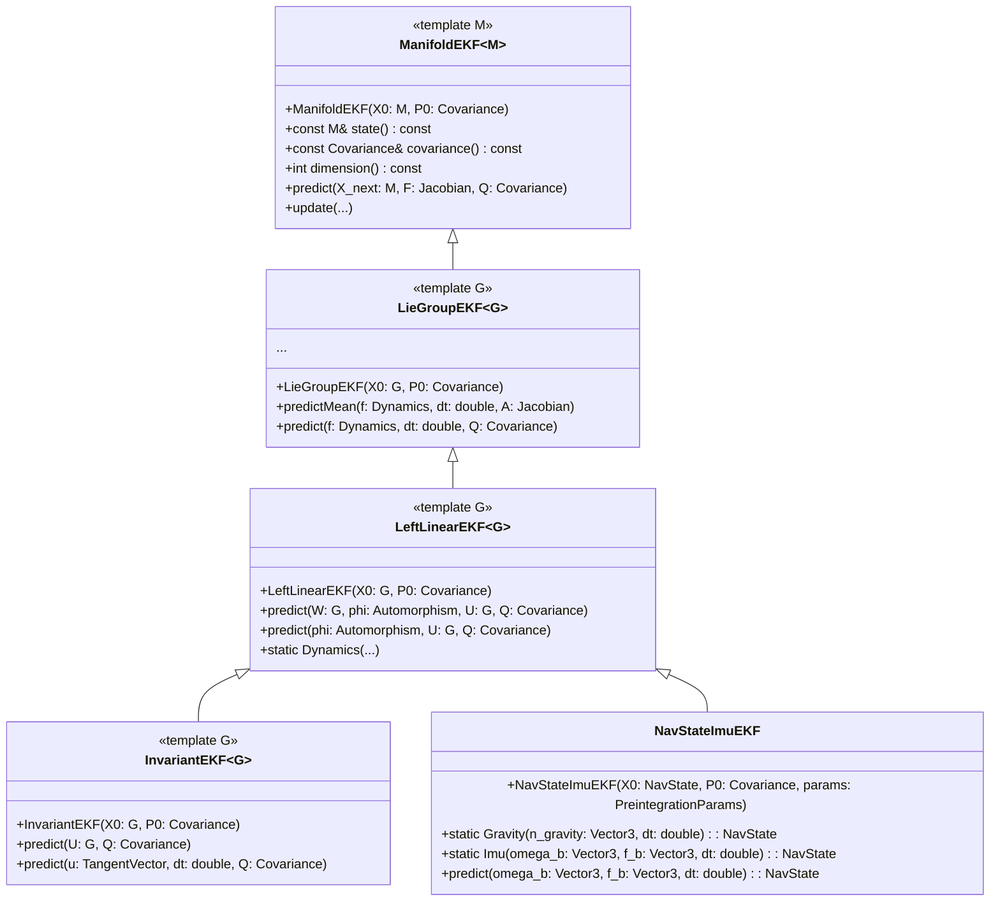

# EKF Variants

Kalman Filters are a widely used tool for state estimation in systems with nonlinear dynamics and measurements. Extended Kalman filters (EKFs) extend the classical Kalman Filter by linearizing the system dynamics and measurement models around a current state estimate, enabling their application to a broad range of real-world problems. However, EKFs have limitations, such as sensitivity to linearization errors and the inability to maintain geometric structure when states reside on differentiable manifolds or Lie groups.

To address these limitations, we will explore a class hierarchy that goes beyond traditional EKFs. This hierarchy introduces specialized filters, such as the ManifoldEKF, LieGroupEKF, and InvariantEKF, which are designed to handle states on manifolds and Lie groups. These filters leverage the mathematical properties of these spaces to improve consistency, convergence, and robustness in state estimation.

### Classes
To introduce the Invariant Kalman Filter to GTSAM, we have created three classes of Extended Kalman Filters in ```navigation```. GTSAM has defined many classes of Lie Groups that may be used with these filters.

- **[ManifoldEKF](https://github.com/borglab/gtsam/blob/develop/gtsam/navigation/ManifoldEKF.h)**: Implements an EKF for states that operate on a differentiable manifold.
- **[LieGroupEKF](https://github.com/borglab/gtsam/blob/develop/gtsam/navigation/LieGroupEKF.h)**: Inherits from ```ManifoldEKF``` and implements an EKF for states that operate on a Lie group with state dependent dynamics.
- **[InvariantEKF](https://github.com/borglab/gtsam/blob/develop/gtsam/navigation/InvariantEKF.h)**: Inherits from ```LieGroupEKF``` and implements EKF for states that operate on a Lie group with group composition (state independent) dynamics.
- **[leftLinearEKF](https://github.com/borglab/gtsam/blob/develop/gtsam/navigation/leftLinearEKF.h)**: Inherits from ```LieGroupEKF``` and implements a more general "left linear observer" structure due to Barrau and Bonnabel.
- **[NavStateImuEKF](https://github.com/borglab/gtsam/blob/develop/gtsam/navigation/NavStateImuEKF.h)**: Specialization of ```leftLinearEKF<NavState>``` that integrates IMU to predict NavState increments; simple API for predict and generic updates. See user guide and tutorial linked below.

Below, the mathematics behind these filters are introduced, and examples of their usage are provided. 
## Extended Kalman Filters
Extended Kalman Filters operate with a state  $x \in \mathbb{R}^n$ in a vector space with a covariance defined in the same vector space. The state transition model and observation model are given by

```math
x_k = f(x_{k-1}, u_{k-1}) + w_{k-1} 
```
```math
z_k = h(x_k) + v_k
```
The state of this system is estimated by using the deterministic portion of the equations above. The covariance is estimated using the Jacobians of the state transition and observation model. Below are the discrete-time equations used by the Extended Kalman Filter. 
### Prediction Stage
The state of the system is predicted using the system dynamics $f$ with a control vector $u$. 
```math
\hat{x}_{k|k-1} = f(\hat{x}_{k-1|k-1}, u_{k-1})
```
The Jacobian, or state transition matrix, of the system is found at the prior state estimate; then
```math
F_k = \frac{\partial f}{\partial x}|_{k|k-1}.
```
The state transition matrix is used to propagate the covariance $P$.
```math
P_{k|k-1} = F_kP_{k-1|k-1}F_k^T + Q_{k-1}
```
The state transition matrix $F_k$ is a function of the state at the current state estimate. This state dependency is the primary source of linearization errors in the EKF. 
### Update Stage
In the update stage, sensor measurements are used to update the state estimate. 

The measurement residual is given by
```math
y_k = z_k - h(\hat{x}_{k|k-1})
```
where $h(\hat{x}_{k|k-1})$ is the predicted measurement. The Jacobian of $h$, or the observation matrix, is given by 
```math
H_k =\frac{\partial h}{\partial x}|_{k|k-1}
```
Once again, the linearization occurs about the current state estimate which leads to additional linearization errors in the EKF. 

The residual covariance is given by
```math
S_k = H_kP_{k|k-1}H_k^T + R_k
```
and the Kalman gain is given by
```math
K_k = P_{k|k-1}H_k^TS_k^{-1}
```
Finally, the state and covariance are updated with
```math
\hat{x}_{k|k} = \hat{x}_{k|k-1} + K_ky_k
```
```math
P_{k|k} = (I - K_kH_k)P_{k|k-1}(I - K_kH_k)^T + K_kR_kK_K^T
```
This covariance update equation is the "Joseph form" which is used for increased numerical stability.

On a manifold, these equations do not maintain the geometric structure when a state operates on a differentiable manifold. 

## ManifoldEKF
The **[ManifoldEKF](https://github.com/borglab/gtsam/blob/develop/gtsam/navigation/ManifoldEKF.h)** class adapts the Extended Kalman Filter equations for states that reside on a differentiable manifold. This class provides a *predict* function that is dependent on the specific motion model and a templated *update* method. In this EKF, the state $X$ lies on the manifold, and the covariance $P$ is found in the tangent space at $X$. 


### ManifoldEKF Predict Stage

In the ```ManifoldEKF``` predict stage, the EKF equations may be propagated in two ways. If the state transition function $f$ directly yields a new state on the manifold, then
```math
\hat{X}_{k|k-1} = f(\hat{X}_{k-1|k-1}, u_{k})
```
Otherwise, if the motion model is an increment $\xi_k$ in the tangent space, then 
```math
\hat{X}_{k|k-1} = \text{retract}(\hat{X}_{k-1|k-1}, \xi_k)
```

ManifoldEKF does not define which method is used. Rather, it is set that $X_{k|k-1} = X_{\text{next}}$
where $X_{\text{next}}$ is defined by the user in their own prediction function. This allows the method to be flexible to any motion model. 

### ManifoldEKF Update Stage
In the tangent space, the residual is given using the local chart; then  
```math
y_k = \text{local}(h(\hat{X}_{k|k-1}), z_k)
```

This yields a new update increment in the tangent space $\delta \xi_k$ where
```math
\delta \xi_k = K_ky_k
```
and the state is updated via the retract operation 
```math
\hat{X}_{k|k} = \text{retract}(\hat{X}_{k|k-1}, \delta \xi_k)
```

```ManifoldEKF``` contains two ```update``` overloads. One ```update``` takes in a measurement model with $h$ and computes its Jacobian $H$. The second version takes in $h$ and a pre-computed Jacobian $H$.

The ```LieGroupEKF``` and ```InvariantEKF``` inherit the predict and update logic from this code. 

## LieGroupEKF
The **[LieGroupEKF](https://github.com/borglab/gtsam/blob/develop/gtsam/navigation/LieGroupEKF.h)** is a specialization of **[ManifoldEKF](https://github.com/borglab/gtsam/blob/develop/gtsam/navigation/ManifoldEKF.h)** for states that reside on a Lie group with **state dependent dynamics**. This class inherits the ```update``` logic from ```ManifoldEKF``` and implements the ```predict``` function for state dependent dynamics.

This class implements two overloaded functions ```predictMean()``` and ```predict()```. The ```predictMean()``` computes the next state estimate and state transition Jacobian $A$, whereas ```predict()``` takes in that state estimate and computes the covariance estimate. 

In ```predictMean()``` the motion model $f$ is passed into the function; then, the tangent space increment is given by

```math
\xi_k = f(\hat{X}_{k-1|k-1}, u_{k-1})
```
and the motion increment is given by 
```math
U_k = \text{Expmap}(\xi_k * \Delta t)
```
The state is then updated using group composition; then
```math
\hat{X}_{k|k-1} = \hat{X}_{k-1|k-1}U_k
```
These functions also compute the full state transition Jacobian $A$ which is state dependent. This ```predictMean()``` passes this result to the ```predict()``` function. 

Overloaded versions of ```predictMean()``` and ```predict()``` also allows the user to pass in their own computed Jacobian $A$. 

This class is useful for generic extended Kalman filtering on Lie Groups; however, it does not have the benefits of the IEKF.

## InvariantEKF

Invariant Extended Kalman Filters (IEKFs) are a special class of Extended Kalman Filters (EKFs) that operate on states that reside on Lie Groups. They are used on a class of systems called group-affine systems where the system dynamics evolve using group composition. This group affine property allows the IEKF to have error dynamics that are **state independent**.

In a standard Extended Kalman Filter (EKF), the system dynamics are linearized around the current state estimate - therefore having state dependent dynamics. If the state estimate has error (which it always does), this linearization accumulates error as well. This characteristic can sometimes lead to poor convergence and poor performance in practice. 

This is where the IEKF sees its greatest benefits. Because of this group affine property, the error propagation is always independent of the state. Therefore, this filter will see improved convergence and consistency even with a poor state estimate. This also allows the filter to converge even with a poor initial estimate of the state. 

The Invariant Kalman Filter operates on many Lie Groups commonly used in robotics, inertial navigation, and SLAM such as  **[SO(3)](https://github.com/borglab/gtsam/blob/develop/gtsam/geometry/SO3.h)**, **[SE_2](https://github.com/borglab/gtsam/blob/develop/gtsam/geometry/Pose2.h)**, **[SE_2(3)](https://github.com/borglab/gtsam/blob/develop/gtsam/navigation/NavState.h)**. This list is not inclusive.

The **[InvariantEKF](https://github.com/borglab/gtsam/blob/develop/gtsam/navigation/InvariantEKF.h)** class further specializes the **[LieGroupEKF](https://github.com/borglab/gtsam/blob/develop/gtsam/navigation/LieGroupEKF.h)** for systems that reside on a Lie group with **state independent dynamics**. It inherits the update logic from ```LieGroupEKF```. 

This class implements the **Left Invariant Extended Kalman Filter** where the prediction methods use group composition.  Let $u$ be a tangent control vector. A Lie group increment is given by $U = \exp(u \cdot \Delta t)$ such that
```math
\hat{X}_{k|k-1} = \hat{X}_{k-1|k-1}U_k
```
The Jacobian $F$ is given by
```math
F_k = Ad_{U_{k}}^{-1}
```

```InvariantEKF``` implements an overloaded ```predict()``` method. One method calls a Lie group increment $U$ directly, whereas the second overload takes in a tangent control vector $u$ and a time interval $\Delta t$ where $U = \exp(u \cdot \Delta t)$.

## LeftLinearEKF
The **[LeftLinearEKF](https://github.com/borglab/gtsam/blob/develop/gtsam/navigation/LeftLinearEKF.h)** class implements a more general prediction model than the `InvariantEKF`. It is based on the paper ["Linear Observed Systems on Groups" by Barrau and Bonnabel](https://www.sciencedirect.com/science/article/pii/S0167691119300805). The dynamics model is given by
```math
X_{k+1} = W_k \phi(X_k) U_k
```
where $\phi$ is an *automorphism* on the group $G$, and $W_k, U_k \in G$ are group elements. An automorphism is a map $\phi:G \to G$ that preserves the group structure, i.e., $\phi(XY)=\phi(X)\phi(Y)$.

The key insight from the paper is that for this model, the error propagation is *still* linear, with the Jacobian given by
```math
F_k = \mathop{Ad}_{U_k^{-1}} \Phi_k
```
where $\Phi_k$ is the Jacobian of $\phi_k$ at the identity. The $W_k$ term completely disappears from the error dynamics.

The `LeftLinearEKF` class implements a `predict` method that takes `W`, a functor `phi` that implements the automorphism $\phi$ and its derivative at identity $\Phi$, `U`, and the process noise `Q`.

## NavStateImuEKF: NavState + IMU EKF

The **[NavStateImuEKF](https://github.com/borglab/gtsam/blob/develop/gtsam/navigation/doc/NavStateImuEKF.ipynb)** is a left-invariant EKF specialized to GTSAM’s NavState $X=(R,p,v)$ that uses IMU measurements to form a NavState increment and composes it onto the current state.

- Predict: `ekf.predict(omega_b, f_b, dt)` uses continuous-time process noise Q scaled by `dt` and composes the IMU-driven increment. Increments for position and velocity are expressed in the body frame, consistent with GTSAM.
- Update: Use the standard EKF update with a measurement model `h(X)` or the vector bridge `updateWithVector(prediction, H, z, R)`. For a world-position measurement, the Jacobian in the EKF local coordinates `[δθ, δp_body, δv_body]` is `H = [0, R, 0]`.

More: **[Full tutorial (with plots)](https://github.com/borglab/gtsam/blob/develop/python/gtsam/examples/NavStateImuExample.ipynb)**, Source: [NavStateImuEKF.h](https://github.com/borglab/gtsam/blob/develop/gtsam/navigation/NavStateImuEKF.h), [NavStateImuEKF.cpp](https://github.com/borglab/gtsam/blob/develop/gtsam/navigation/NavStateImuEKF.cpp)


# Examples 
Below are four examples of these filters in action. 
1) **[IEKF_SE2Example](https://github.com/borglab/gtsam/blob/develop/examples/IEKF_SE2Example.cpp)**: implements ```InvariantEKF``` on a SE(2) Lie Group with odometry as a Lie group increment and a 2D GPS measurement update.
2) **[IEKF_NavstateExample](https://github.com/borglab/gtsam/blob/develop/examples/IEKF_NavstateExample.cpp)**: implements ```InvariantEKF``` on a NavState Lie Group with a tangent space increment based on IMU measurements, and a 3D GPS measuremnt update.
3) **[GEKF_Rot3Example](https://github.com/borglab/gtsam/blob/develop/examples/GEKF_Rot3Example.cpp)**: implements ```LieGroupEKF``` on a Rot3 Lie Group using a state dependent dynamics function and a magnetometer update.
4) **[NavStateImuExample](https://github.com/borglab/gtsam/blob/develop/examples/NavStateImuExample.cpp)** and the accompanying notebooks: [user guide](gtsam/navigation/doc/NavStateImuEKF.ipynb) and a [full tutorial](python/gtsam/examples/NavStateImuExample.ipynb) demonstrate the NavStateImuEKF.


##  InvariantEKF Example on SE(2) using Lie Group increments
The  **[IEKF_SE2Example](https://github.com/borglab/gtsam/blob/develop/examples/IEKF_SE2Example.cpp)** demonstrates the use of an Invariant EKF with a simple odometry increment and a 2D GPS measurement processor. 

#### Defining a GPS Measurement Function
The predicted GPS measurement $h_k$ is given by the translation of the predicted state estimate. Then, the GPS measurement function is given by
```cpp
Vector2 h_gps(const Pose2& X, OptionalJacobian<2, 3> H = {}) {
  return X.translation(H);
}
```

#### Creating and Initializing the EKF
The initial state and covariance need to be defined to create the filter.
```cpp
  Pose2 X0(0.0, 0.0, 0.0);
  Matrix3 P0 = Matrix3::Identity() * 0.1;
```

The filter can then be created with
```cpp
  InvariantEKF<Pose2> ekf(X0, P0);
```

For this example, assume constant process and observation covariances. They are defined as
```cpp
  Matrix3 Q = (Vector3(0.05, 0.05, 0.001)).asDiagonal();
  Matrix2 R = I_2x2 * 0.01;
```

#### Defining odometry and measurements
Two simple odometry steps with a Lie group increment $U$ are used and defined as
```cpp
Pose2 U1(1.0, 1.0, 0.5), U2(1.0, 1.0, 0.0);
```
Two GPS measurements are also created; 
```cpp
  Vector2 z1, z2;
  z1 << 1.0, 0.0;
  z2 << 1.0, 1.0;
```

#### Running the EKF
The EKF is propagated using odometry with
```cpp
ekf.predict(U1, Q);
```

and updated using measurements via
```cpp
ekf.update(h_gps, z1, R);
```

## InvariantEKF on Navstate using a tangent space increment
The **[IEKF_NavstateExample](https://github.com/borglab/gtsam/blob/develop/examples/IEKF_NavstateExample.cpp)** demonstrates the use of an Invariant EKF with a tangent space increment based on IMU measurements transformed into the tangent space and a 3D GPS measurement processor. The Lie Group is NavState, or $\mathcal{SE}_2(3)$.

#### Defining the Dynamics
An IMU utilizes accelerometers and gyroscopes to estimate the pose of the robot. This is commonly used in inertial navigation aboard aircraft. An accelerometer and gyroscope measures the proper acceleration and the angular velocity experienced by the body. Then, $u = [a_x, a_y, a_z, w_x, w_y, w_z]^T$. Transforming this to the tangent space, $\xi = [w_x, w_y, w_z, 0, 0, 0, a_x, a_y, a_z]^T$. The dynamics function, then, is given by

```cpp
Vector9 dynamics(const Vector6& imu) {
  auto a = imu.head<3>();
  auto w = imu.tail<3>();
  Vector9 xi;
  xi << w, Vector3::Zero(), a;
  return xi;
}
```

#### 3D GPS Measurement Processor
The predicted GPS measurement is simply the 3D position estimate of the current state estimate. Then,
```cpp
Vector3 h_gps(const NavState& X, OptionalJacobian<3, 9> H = {}) {
  return X.position(H);
}
```

#### Creating and Initializing the EKF
The initial state and covariance are given by
```cpp
  NavState X0;  // R=I, v=0, t=0
  Matrix9 P0 = Matrix9::Identity() * 0.1;
```
and the IEKF is created using
```cpp
  InvariantEKF<NavState> ekf(X0, P0);
```

For this example, assume constant process and observation covariances. Then,
```cpp
  Matrix9 Q = Matrix9::Identity() * 0.01;
  Matrix3 R = Matrix3::Identity() * 0.5;
```

#### Defining IMU and GPS measurements
Two IMU measurements and two GPS measurements are defined in this problem. The IMU measurements are given by
```cpp
  Vector6 imu1;
  imu1 << 0.1, 0, 0, 0, 0.2, 0;
  Vector6 imu2;
  imu2 << 0, 0.3, 0, 0.4, 0, 0;
```
and the GPS measurements are given by
```cpp
  Vector3 z1;
  z1 << 0.3, 0, 0;
  Vector3 z2;
  z2 << 0.6, 0, 0;
```
Since control vector inputs $u$ are used, a time interval $\Delta t$ is also needed. This is defined as 
```cpp
  double dt = 1.0;
```

#### Running the EKF
The prediction stage is called using
```cpp
 ekf.predict(dynamics(imu1), dt, Q);
```

and the update stage is called using

```cpp
  ekf.update(h_gps, z1, R);
```

## LieGroupEKF on Rot3 using a state dependent dynamics function 
The **[GEKF_Rot3Example](https://github.com/borglab/gtsam/blob/develop/examples/GEKF_Rot3Example.cpp)** demonstrates the use of a Lie Group EKF with a state dependent dynamics function. This example combines a Lie Group EKF with a proportional attitude controller that drives the pitch and roll of the object to zero. The angular velocity $\xi$ is proportional to the roll and pitch of the body; therefore, our tangent space increment $\xi$ is state dependent. The angular velocity is independent of yaw. A magnetometer is used to update the orientation. 

#### Defining the Dynamics Function
A proportional controller is used as the dynamics function. The previous state estimate is used to find a new angular velocity which is used in the group EKF to predict the next state. 
The proportional gain $k$ is defined as a double where
```cpp
static constexpr double k = 0.5;
```

The dynamics function is created below. The following code is inside of the function.
```cpp 
Vector3 dynamicsSO3(const Rot3& X, OptionalJacobian<3, 3> H = {}) {
}
```
The previous state estimate is found by bringing the state estimate into the vector space by a Logmap. The Jacobian of this operation is given by D_phi and is computed by the Logmap function. Then,  
```cpp
  Matrix3 D_phi;
  Vector3 phi = Rot3::Logmap(X, D_phi);
  phi[2] = 0.0;
  D_phi.row(2).setZero();
```
where yaw is set to zero as the attitude controller estimates pitch and roll. The Jacobian also sets the row corresponding to yaw to zero, as yaw is not observed. 

Lastly, the dynamics function computes the state transition matrix $H$ (normally denoted by $F$ or $A$) and the tangent space increment $\xi$ by 
```cpp
  if (H) *H = -k * D_phi;  // ∂(–kφ)/∂δR
  return -k * phi;         // xi ∈ 𝔰𝔬(3)
```

#### Defining a Magnetometer Update
A magnetometer measures a magnetic field vector and references it to a known magnetic field model.
Let $m^w$ be the magnetic field vector in the world. The magnetic field vector is rotated into the body frame by
```math
h = (R_b^w)^{-1} m^w
```
where $R_b^w$ is a rotation matrix from the body frame to the world frame. This rotation matrix is the current state of the system. 
The state transition matrix $A$ is given by the negative skew symmetric matrix of $h$. 


The magnetic field vector is defined as 
```cpp
static const Vector3 m_world(0, 0, -1);
```
The measurement function is defined as 
```cpp
Vector3 h_mag(const Rot3& X, OptionalJacobian<3, 3> H = {}) {
  Vector3 z = X.inverse().rotate(m_world);
  if (H) *H = -skewSymmetric(z);
  return z;
```

#### Creating and Initializing the EKF
The state and covariance must be initialized, so
```cpp
  const Rot3 R0 = Rot3::RzRyRx(0.1, -0.2, 0.3);
  const Matrix3 P0 = Matrix3::Identity() * 0.1;
```
and the LieGroup EKF is created using
```cpp
  LieGroupEKF<Rot3> ekf(R0, P0);
```

For this example,assume constant process and observation covariances. A time interval $\Delta t$ is needed for the tangent space increment; then
```cpp
  double dt = 0.1;
  Matrix3 Q = Matrix3::Identity() * 0.01;
  Matrix3 Rm = Matrix3::Identity() * 0.05;
```
#### Running the EKF
The prediction stage is called using
```cpp
  ekf.predict(dynamicsSO3, dt, Q);
```
The magnetometer measurement $z$ is found by taking a body frame measurement of the world vector; then, 
```cpp
Vector3 z = h_mag(R0);
```
and the EKF is updated using the magnetometer measurement by
```cpp
ekf.update(h_mag, z, Rm);
```


# Class Diagram
The relationship between these classes are visualized below. 




